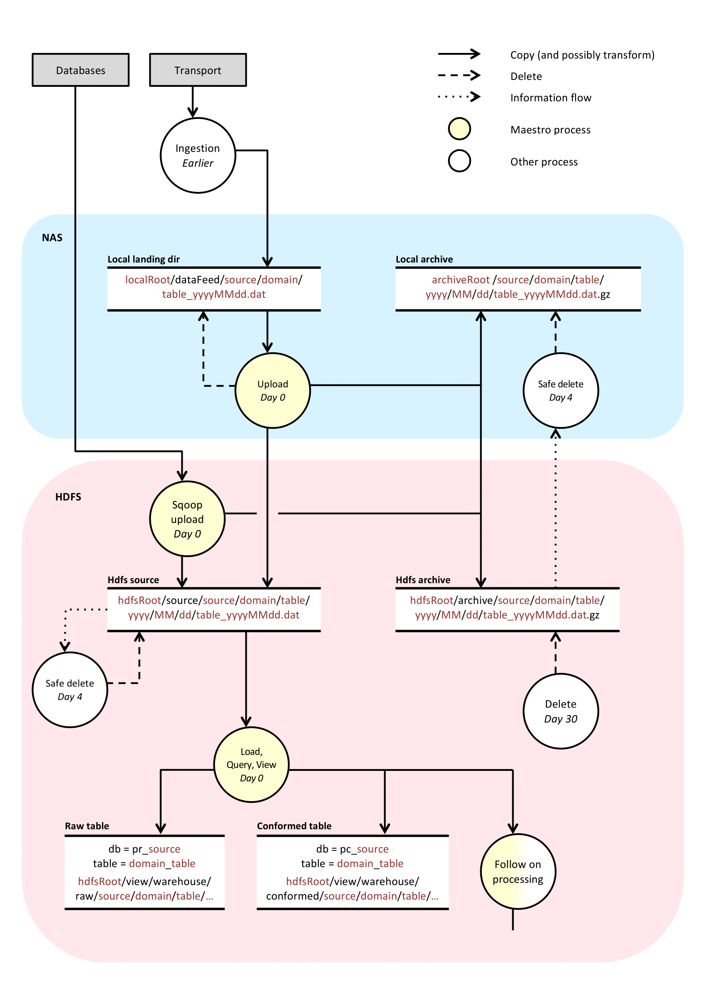

Design of etl-pipelines in a larger context
===========================================

Maestro itself is actually just a collection of libraries, it doesn't do anything. In order to fully understand its design, it is important to have some context for its usage. In our world we have an ever growing group of people who want to onboard data to our big data environment, and this is a good thing because our big data environment is meant for analytics and prediction and data helps in such pursuits. At a high level our _data developers_ (I am not promoting putting people in boxes) use Maestro to build ETL pipelines to onboard data into our Hive data warehouse, and then ultimately into our [feature store](https://github.com/ambiata/ivory). In the process, data is sent to various places and follows a fairly standard pattern (hopefully). The concrete SBT project that houses these logics is called `etl.pipelines` (obviously not open source). Each sub project within `etl.pipelines` has a specific group of etl logic. The grouping is based on various concepts:

* Source system
* Logical grouping
* Interdependency in time/SLA

The following overly simplified diagram tries to illustrate the high level components we are dealing with:

Our use cases can be grouped into:

* Exploratory analytics: This concept is poorly defined, but essentially means the ability to execute declarative queries across various representations in order to find patterns or understand the data, and integration with traditional analytics tools such as SAS.
* Predictive analytics: The ability to build predictive models using machine learning techniques. In our world these models are usually built with open source tools such as R, Python and [Vowpal Wabbit](http://hunch.net/~vw/).
* Data hub: In order to have as much data as possible, we have positioned our Hadoop platform as a data integration hub, thus we get all the data. Note that this is different from the more common positioning of Hadoop as primarily an enterprise data hub. We see the data hub as a side effect of doing analytics. That does not mean that the data hub is a second class citizen, quite to the contrary we have a strong focus on doing data integration, transform, load, data management and data quality excellently. 

Skill and roles add another dimension to this problem. We have people who are classified as data scientists. I am not going to try and define what a data scientists is. Suffice to say that they typically have a very high skill level and we can't define what they do on a day to day basis (in the same way as we can't define the outcomes of research). We try to ensure that data is loaded and managed in an effective manner, and loaded into the stores which they need to do their job and then they can use any tool they like for that purpose. Thus I haven't gone into much detail about the "DS Pipelines" blob above. 

We have a conceptual distinction between an entity centric view (feature store) and event centric view (event store). The differences are conceptual in nature and don't imply any difference in the storage layers (although there usually are differences). _Feature_ is a term from machine learning that can roughly be defined as:

> A feature is an individual measurable heuristic property of a phenomenon being observed. Choosing discriminating and independent features is key to any pattern recognition algorithm being successful in classification. Features are usually numeric, but structural features such as strings and graphs are used in syntactic pattern recognition.

So, where does Maestro fit in? Maestro aims to solve the integration, warehouse management and ETL problems. What does solve mean, especially when there are already many tools that combine to solve these issues? Solve means to solve the problem without hand waving over the edge cases, making the code testable and generally integrate all the tools in a manner that is not brittle. Beyond simply integrating these tools, Maestro starts to and will continue to provide a suite of tools for data management. 

_Managing data and looking good doing it_
 

Delivery Approaches and Context
-------------------------------

Hadoop comes from an entirely different world to the one it is working its way into. What I mean by that is that engineering centric organisations built, adopted and proved Hadoop and related technologies. Engineering cultures value the delivery process. They value the things that enable teams to build amazing software. Software engineering, computer science and data science are first class citizens in their business. In the corporate world, IT has been grouped together for some time into a single bucket that _"Doesn't Matter"_. The term is deceiving, but it originally comes from Nicolas Carr's article and book titled "Does IT Matter?". Corporate environments typically have a strong distinction between "Business" and "IT", where IT is a cost center, a necessary evil, but not a value creator or driver. In this context, vendor solutions have thrived for years on notions of making engineering unnecessary. Drag and drop style tools, that enable non development and non engineering staff to deliver new functionality. This approach works really well in demos but becomes increasingly brittle and costly over time. 

A further dimension to this is the database/datawarehouse delivery approach versus the software delivery approach. In a data warehouse the focus is on preventing change, tools of the trade are SQL, and well, SQL. SQL is mature and in all respects awesome, except it has been so widely taught without any strong notions of software delivery and all its associated goodness. Mutating of structures, no version control (or very light version control), no testing, stringly types, brittle pipelines, etc.. And as a result change is not favoured, it is always a risk. 

The alternative is a well engineered solution delivery approach. This can be a difficult thing to commit to since it requires a different set of skills and requires projects to go slower in the beginning while the delivery process, tooling and rigour are invested in and bedded down. 

With Maestro we are trying to resolve some of these differences, or at least make reasonable trade offs to remove constraints and make these differences tenable. These technical aspects will be listed shortly. However, it is important to state that the team building Maestro obviously values mature software engineering, but recognises there is a base of existing skills which must be catered for and enabled in the pursuit of delivering mature data processing pipelines and data management. We believe that our trade offs are practical and moral. We have optimised towards correctness as opposed to ease of use (in the demo sense of the term). To bridge that gap we are focussing heavily on training and development.

###Technical positions and trade offs within Maestro

* There is a wide range of tooling and solution built around Hive, and the Hive Meta Store (Hive, Impala, Spark SQL, etc.) which are focussed on end user requirements. We need to support these systems as first class citizens in our world. 
* Domain specific languages are important however they should strangle the developer when edge cases arrive (which is extremely often in the real world), therefore, we prefer embedded DSLs over external DSLs where possible.
* Meta data can't be stored in some mutating structure (Hive Meta Store), or at least it can't be mastered there. Code, which is in version control, makes assumptions about the state of the meta store and these assumptions need to hold in a version controlled manner. Therefore in a Maestro world, the meta store is not the source of truth but rather there for integration and optimisation.
* SQL is excellent for exploring and working with data that is already inside a warehouse or relational store of some kind. It is insufficient for integration purposes. Even if it were sufficient, it would breed tight coupling over time.
* Compile time safety and correctness: we don't like waiting for things to fail on the cluster. Between the type system, tests and automation we attempt to ensure that failures happen on our local machines and not on the cluster.
* Given the massive amount of SQL skills and its underlying value, we support SQL as a first class citizen.
* Given the awkward support for SQL in the Hadoop world, we need to be able to safely refactor out SQL that needs to be manually optimised using a more powerful API/DSL like [Scalding](https://github.com/twitter/scalding). 
* We don't believe that every data load should choose which storage format to use. A wide array of storage formats is bad from a tooling and delivery coupling perspective. Therefore, Maestro has chosen to support Parquet and Thrift as first class citizens, and all other formats as integration concerns. 
* High level orchestration is actually a bad thing, and so we support orchestration where it makes sense for an atomic unit of work. However, we believe that reactive scheduling makes more sense in terms of flexibility, robustness and decoupling.
* Continuous integration and continuous delivery are as important to data application as they are to the frameworks on which these applications are based. Our data developers are required to write automated tests using Maestro provided API. This is vital to allows us to maintain macro level agility of our big data platform. We can safely upgrade our Hadoop version, run the builds and know what we have broken and because we use [specs](http://etorreborre.github.io/specs2/) we have a good idea what the code is supposed to be doing and can realistically refactor where required.   

Ingestion Integration
---------------------

Integration is hard. Its right up there with naming, concurrency and "off by one" errors. In the world of Hadoop you have a few options: 

* Some commercial tools (and semi-commecial tools), e.g. Data Stage, Talend, etc.. All of these may be excellent options in your world, however, they don't choose software delivery as the default delivery approach and, therefore, become brittle quickly. (I can't reason about the 1000s of lines of generated XML that I can't diff or test, etc..)
* A combinations of Hive, Scoop, Oozie, Pig: This is the default option in the Hadoop community, and over and above the integration problem, this is the default combination for achieving what Maestro sets out to achieve. So, why not just use this combination?
** _Generic Reasons:_
*** In their own right, each of these tools is fine. However, integrating them becomes a matter of stringly typed brittleness. What I mean by that is that practically there are numerous places where strings need to exactly match in order for the tools to magically work together. Paths, parameter names, property names, etc... and if any of these isn't aligned then the overall job fails, and there is no way to ensure correctness. 
*** Each of these tools is difficult to test in the small, and therefore include in some level of continuous integration.
*** Pig is an excellent tool, but is an external DSL, and, as a result, the moment you need to do something outside of what was originally envisaged you have to switch context to another language. And in the case of Pig, the means something as simple as writing a test. 
** _Integration Reasons:_
*** You can easily scoop data onto HDFS, and then use Hive to process this data as an external table. However, the moment the data is in some format that dosen't meet Hive's assumptions you will have a problem. For example, if you define a field as a number and the value is " 1" instead of "1", Hive will drop the value. Now I realize that there are many workarounds for this. However, they are all workarounds. Integration is a sufficiently varied process that assuming that a subset a standardised declarative syntax designed for query will cover all the edge cases
*** System coupling: The second reason is far more subtle and insidious. System release decoupling is enabled or made impossible by system coupling. Properly decoupling systems at an interface level is not a trivial task which is not enabled in any way by the above mentioned technologies.

Storage
-------

Text as a storage format is bad. I am not going to go into it further, you can take my word for it, text is bad. So with that out of the way, what should I use instead? Before I answer that, let me be clear again about the high level context. Maestro deals in Hive tables, that is to say our first task is to store data in a dense 2-dimensional form that is ideal for exploratory analytics via at least SQL. From there the data always ends up in other formats (Feature Store, Event Store, Search Index, etc.). The reason for this progression is that almost all our source systems are based on relational databases. Hence, the discussion around data format needs to be separated into two. The first par and focus of this section is the format of data which is being stored and managed in the Hive wharehouse and is of course being managed via Maestro. For the second part, this becomes a matter of downstream integration and is covered in a later section of the document.

We have chosen Parquet for the following reasons:

* Columnar storage formats makes sense, especially 
* There are various options for columnar storage, but they essentially boil down to who you are backing, Cloudera or Hortonworks. We have married Cloudera (for better or for worse) and as a result it would not be wise to choose ORC. 
* Together with Impala, Yarn and a decent size cluster, it enables the Google Dremel model quite well. 

[Parquet MR](https://github.com/Parquet/parquet-mr) has its own binary format. However, it allows you to specify the structure using various other data description languages (Thrift, Avro, Protocol Buffers). The tooling inside parquet-mr then perform the transaction between these structures and the underlying parquet binary on disk. We use thrift heavily and this became the natural choice for us. The only problem is that there is a mixed bag of support for thrift in parquet-mr. This, together with a distinct lack of partitioning support propted us to build [Ebenezer](https://github.com/CommBank/ebenezer), which extends parquet-mr with read and write support with [Scrooge](https://github.com/twitter/scrooge) and adds base hive integration with cascading (partitioning and related).

With [Ebenezer](https://github.com/CommBank/ebenezer) in place, we are able to ensure that text only exists in our source data (where we could only get it that way), and after ingestion integration is complete (see load task). All data exists in parquet tables that at least contain structural types. 

As a result of this, our queries also perform far better and storage size is greatly reduced as a result of run length encoding and snappy compression. Note that if you are not IO bound then you have a HPC problem, not a Big Data Problem (we will be releasing some tooling for that too soon). 

Standard ETL pipeline
---------------------

The Maestro API seems to lead you down a particular path in terms of an ingestion workflow. While Maestro isn't prescriptive in terms of a stanard load pattern, it is useful to describe our standard load pattern for context. In the case of a file based load, the following steps are undertaken:

1. Load the source data onto HDFS
1. Zip and archive the source data on the integration server(s)
1. Load the source data a into typed, partitioned parquet table, that is otherwise true to source
1. Transform the data into a cleaned, conformed table 
1. Load the data into our feature store [Ivory](https://github.com/ambiata/ivory)

There are numerous cases where downstream integration is performed. In our case we often transfer data to our actual data warehouse (Terradata based) and others where we integrate with downstream systems (general ledger, etc.). The flow of data can split off at various points in this generic flow. In some cases we transform data from source and transfer it to our Teradata warehouse, in other cases we only transfer our conformed or engineered features to downstream systems.

The API allows for any combination of the above flows to be constructed, but remember that the idea is that Hive/SQL is not used for the purposes of integration. Therefore only Maestro API calls should be used for Steps 1,2,3 and 5. Step 4 will typically contain various steps (Hive and Scalding based), transformation, feature engineering, business rules, etc.. But all these steps take place within the Hive warehouse, where any given Hive query has as its source and destination Hive table. 

The final piece to consider is the flow of data onto the platform and the archival strategy which Maestro caters for. Here is a diagram illustrating in a very basic manner our environment: 

Essentially we have 2 clusters. I won't go into the details as to the purposes of both apart from to say that they exist for different purposes, and they also act as a primary and DR (disaster recovery) pair. We also have strong zone models, at a network level, for security reasons. As a result we have edge nodes outside the cluster for management and integration. Between the clusters we have selective data synchronisation. However, given the data volumes, network realities and cluster load we can only rely on the data being replicated at T+1 (the next day). Our integration servers, therefore, provide DR capabilities for near line data. Consider the following flow diagram:

Data lands on the integration node(s), where it is immediately transfered onto HDFS for further downstream processing. It is also compressed and stored on the NAS and HDFS. As a result there are immediately 4 copies of the data. 2 copies on the NAS (1 un-compressed and 1 compressed) and similarly 2 copies on HDFS. The source data then gets removed from the NAS and HDFS a day after processing. The compressed copy on the NAS gets removed up to 7 days after processing, and finally the compressed data on HDFS gets removed up to 30 days after processing. Note that we aren't _losing_ data, we are processing the data into our internal parquet tables, which are true to source. These various copies of the data are there to support DR processes, and reduce operational risks. If we introduce a bug into our basic ingest code, we have the source data on hand to re-ingest into the 'true to source' tables (even though this is highly unlikely). 

Types
-----

We are strong believers in a positive type system and functional programming (in the way Haskell defines functional programming). We think [Scalaz](https://github.com/scalaz/scalaz) is pretty awesome (although documentation is severely lacking), together with some of the other [type level](typelevel.org) projects. I am not going to try and convince you of these beliefs here, suffice to say that if your job fails after 6 hours because of a typo, your day isn't going very well, and if that happens twice in a short delivery cycle you have missed your goals for that delivery. Types, tests, and frameworks like cascading go a long way to enable us to test and reason about our code in the small, long before they hit the cluster. 

All of that is excellent in principle. Unfortunately, in practice there are real constraints to making this tenable. We have insane source tables with 900 columns, meaning that if we want to process these in a [type safe](https://github.com/twitter/scalding/wiki/Type-safe-api-reference) manner we are going to have problems. Scala has some 22 field limits on Tuples, and if we don't want to propogate mutation then the JVM has a 254 parameter limit on methods and constructors. 

We have invested significant effort into enabling type safe functionality in our pipelines, in a way that is entirely tenable for the API user, while still being correct from a functional perspective. The result is a set of macros that enable typesafe pipelines to built for structures as wide as 1000+ columns. Let the compiler do the hard work! 

Transformation
--------------

Because we use the typesafe API, transformations on narrow (sane) types is simply vanilla scala code. When dealing with really wide structures the API quickly gets unwieldy. We are currently working on some API to make this more tenable, and this section will be updated once that is complete. 

Metadata Management
-------------------

At present we use Thrift as the means to define our structures. SBT plugins build these out into classes that are used to build out this API dynamically through macros. Unfortunately, Thrift is quite limited in order to take this approach through to its logical conclusion, and we are, therefore, in the process of upgrading Maestro to use a richer meta data language, which will enable us to deal with external database tables consistently (well typed), and also enable semantic cleaning and conformance of data through the use of richer types or [topes](http://web.engr.oregonstate.edu/~cscaffid/papers/eu_20070914_topemod.pdf).

Downstream Integration
----------------------

TBD

Scheduling
---------

The design for reactive scheduling is coming soon.
